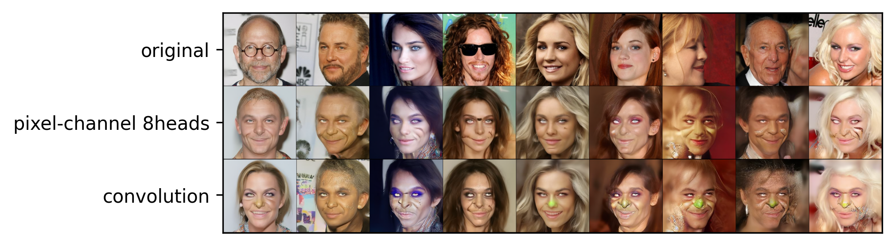
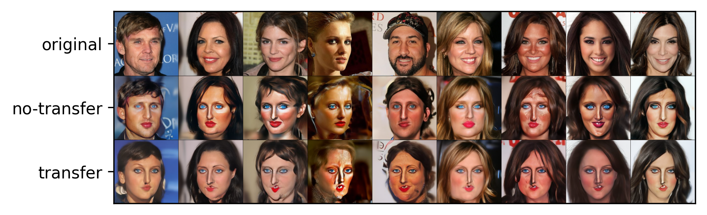

# A Deep Dive Into "Diffusion Models Already Have a Semantic Latent Space"

### J. R. Gerbscheid, A. Ivășchescu, L. P. J. Sträter, E. Zila

---

This repository contains a reproduction and extension of ["Diffusion Models Already Have a Semantic Latent Space"](https://arxiv.org/abs/2210.10960) by Kwon et al. (2023). 

To read the full report containing detailed information on our reproduction experiments and extension study, please, refer to our [blogpost](blogpost.md).

## Requirements

To install requirements:

```setup
conda env create -f environment.yml
```

To download the CelebA-HQ dataset (to [`src/data/`](src/data/)) and pretrained weights for its diffusion model (to [`src/lib/asyrp/pretrained/`](src/lib/asyrp/pretrained/)):

```data
bash src/lib/utils/data_download.sh celeba_hq src/
rm a.zip

mkdir src/lib/asyrp/pretrained/
python src/lib/utils/download_weights.py
```

## Training and Inference 

Training and inference scripts for all models are located in the [`src/lib/asyrp/scripts/`](src/lib/asyrp/scripts/) folder.

## Evaluation and Demos

To perform evaluation of the results and reproduce our results, refer to the corresponding notebooks in the [`demos/`](demos/) folder.

## Pre-trained Models and Pre-computed Results

You can download our pre-trained models and pre-computed results via [our Google Drive directory](https://drive.google.com/drive/folders/1ShiRe1tfKER24GNeH7CpR3ffH3DhFiEX?usp=sharing).

## Results

### Reproduction

As part of our reproduction study, we successfully replicate results achieved by the original authors for in-domain attributes:

<table align="center">
  <tr align="center">
      <td></td>
  </tr>
  <tr align="left">
    <td colspan=2>Editing results for in-domain attributes.</td>
  </tr>
</table>

In the same manner, we replicate the results for unseen-domain attributes:

<table align="center">
  <tr align="center">
      <td></td>
  </tr>
  <tr align="left">
    <td colspan=2>Editing results for unseen-domain attributes.</td>
  </tr>
</table>

Nevertheless, we are unable to replicate the directional CLIP score, $S_{dir}$:

<table align="center">
	<tr align="center">
		<th align="left">Metric</th>
		<th></th>
		<th>Smiling (IN)</th>
		<th>Sad (IN)</th>
		<th>Tanned (IN)</th>
		<th>Pixar (UN)</th>
		<th>Neanderthal (UN)</th>
	</tr>
	<tr align="center">
		<td align="left">Original $S_{dir}$</td>
		<td>$\Delta h_t$</td>
		<td>0.921</td>
		<td>0.964</td>
		<td>0.991</td>
		<td>0.956</td>
		<td>0.805</td>
	</tr>
	<tr align="center">
		<td align="left">Reproduced $S_{dir}$</td>
		<td>$\Delta h_t$</td>
		<td>0.955<br>(0.048)</td>
		<td>0.993<br>(0.037)</td>
		<td>0.933<br>(0.040)</td>
		<td>0.931<br>(0.032)</td>
		<td>0.913<br>(0.035)</td>
	</tr>
	<tr align="center">
		<td align="left">Reproduced $S_{dir}$</td>
		<td>$0.5 \Delta h_t$</td>
		<td>0.969<br>(0.047)</td>
		<td>0.999<br>(0.035)</td>
		<td>0.973<br>(0.036)</td>
		<td>0.942<br>(0.031)</td>
		<td>0.952<br>(0.035)</td>
	</tr>
	<tr align="left">
		<td colspan=7>Directional CLIP score ($S_{dir} \ \uparrow$) for in-domain (IN) and unseen-domain (UN) attributes. Standard<br>deviations are reported in parentheses.</td>
	</tr>
</table>

However, our results successfully demonstrate linearity of $\Delta h_t$:

<table align="center">
  <tr align="center">
      <td></td>
  </tr>
  <tr align="left">
    <td colspan=2>Image edits for the "smiling" attribute with editing strength in the range from -1 to 1.</td>
  </tr>
</table>

Also, we show that by using additional steps ($t = 1000$) in the reverse diffusion process at inference time, we can recover details lost during reconstruction even after increasing the training speed by using $t = 40$ during training:

<table align="center">
  <tr align="center">
      <td></td>
  </tr>
  <tr align="left">
    <td colspan=2>Comparison of generated images for the "smiling" attribute with 40 and 1000 time steps during generation.</td>
  </tr>
</table>

### Ablation Study

By exchanging the convolutional layers in the original architecture of Asyrp for transformer-based blocks, we achieve the following qualitative results:

<table align="center">
  <tr align="center">
      <th></th>
      <th></th>
      <th></th>
  </tr>
  <tr align="left">
    <td colspan=3>The effect of the number of transformer heads on the "pixar" attribute for the pixel-channel transformer architecture.</td>
  </tr>
</table>

In terms of the Frechet Inception Distance ($FID$), our transformer-based model significantly outperforms the original convolution-based model.

<table align="center">
	<tr align="center">
		<th align="left">Model</th>
		<th>Smiling (IN)</th>
		<th>Sad (IN)</th>
		<th>Tanned (IN)</th>
		<th>Pixar (UN)</th>
		<th>Neanderthal (UN)</th>
	</tr>
	<tr align="center">
		<td align="left">Original</td>
		<td>89.2</td>
		<td>92.9</td>
		<td>100.5</td>
		<td>125.8</td>
		<td>125.8</td>
	</tr>
	<tr align="center">
		<td align="left">Ours</td>
		<td><b>84.3</b></td>
		<td><b>88.8</b></td>
		<td><b>82.2</b></td>
		<td><b>83.7</b></td>
		<td><b>87.0</b></td>
	</tr>
	<tr align="left">
		<td colspan=6>Comparison of Frechet Inception Distance ($FID \downarrow$) metric for in-domain (IN) and <br> unseen-domain (UN) attributes between the original model and our best model.</td>
	</tr>
</table>

The improved quality can be observed, for example, when qualitatively comparing editing results for an entirely new "goblin" direction:

<table align="center">
  <tr align="center">
      <th></th>
  </tr>
  <tr align="left">
    <td colspan=2>Comparison of convolution-based and transformer-based architecture output for a new "goblin" attribute without hyperparameter tuning.</td>
  </tr>
</table>

Additionally, we show that costs of training a new model for each new editing direction can be reduced by finetuning a pre-trained model which converges much faster than training the model from scratch:

<table align="center">
  <tr align="center">
      <th></th>
  </tr>
  <tr align="left">
    <td colspan=3>Comparison of results achieved by training from scratch and finetuning a pre-trained model after training for 2000 steps.</td>
  </tr>
</table>

---

## Lisa Compute Cluster Reproduction Instructions

In addition to having the ability to reproduce the results locally as described above, the repository contains a set of `.job` files stored in [`src/jobs/`](src/jobs) which have been used to run the code on the [Lisa Compute Cluster](https://www.surf.nl/en/lisa-compute-cluster-extra-processing-power-for-research). Naturally, if used elsewhere, these files must be adjusted to accommodate particular server requirements and compute access. In order to replicate the results in full, the following must be executed (in the specified order):

To retrieve the repository and move to the corresponding folder, run the following:

```repository
git clone git@github.com:zilaeric/DL2-2023-group-15.git
cd DL2-2023-group-15/
```

To install the requirements, run the following:

```requirements
sbatch src/jobs/install_env.job
```

To download datasets (to `src/data/`) and pretrained models (to `src/lib/asyrp/pretrained/`), run the following:

```downloads
sbatch src/jobs/download_data.job
```

Subsequently, the other `.job` files located in [`src/jobs/`](src/jobs) can be used to run the scripts found in the [`src/lib/asyrp/scripts/`](src/lib/asyrp/scripts/) folder.
