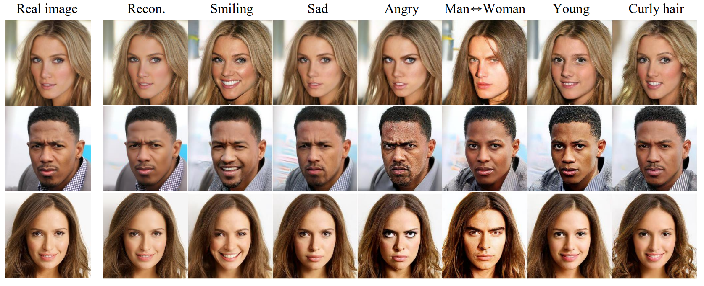
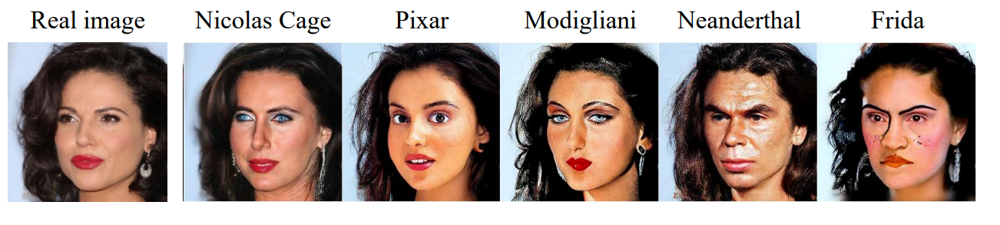

# Advancing Our Understanding of Diffusion Models:   A Deep Dive Into "Diffusion Models Already Have a Semantic Latent Space"

### J. R. Gerbscheid, A. Ivășchescu, L. P. J. Sträter, E. Zila

---

In this blog post, we will discuss, reproduce and extend on the findings of the ICLR2023 paper titled ["Diffusion Models Already Have a Semantic Latent Space"](https://arxiv.org/abs/2210.10960). The paper introduces an algorithm called asymmetric reverse process (Asyrp) to uncover a semantic latent space in the bottleneck of frozen diffusion models. The authors showcase the effectiveness of Asyrp in the domain of image editing.

**Goal of this blog post:** The purpose of this blog post is threefold: 
1. Help other researchers understand the algorithm (Asyrp). 
2. Verify the authors' claims by reproducing the results. 
3. Extend on the discussion points of the paper.

## Image Editing Using Diffusion Models

Diffusion models (DM) can be effectively used for image editing, i.e., adding target attributes to real images. Multiple ways of achieving the task have been explored in the past, including image guidance \[1, 10\], classifier guidance \[3, 9\], and model fine-tuning \[7\]. These methods, however, fall short either because of the ambiguity and lack of control of the steering direction and magnitude of change, or because of the high computational costs they induce. Observing the capabilities of GANs that directly find editing directions from the latent space, hints that the discovery of such a space in diffusion models would provide great image editing capabilities. A way of obtaining it was suggested by Preechakul et al. \[14\], who add to the reverse diffusion process the latent vector of the original image produced by an extra encoder. The problem of this model is that it can not use pretrained diffusion models, as they have to be trained with the added encoder. This is why Kwon et al. \[8\] proposed Asyrp, which finds editing directions from the latent space in pretrained diffusion models.

Asyrp discovers semantic meaning in the bottleneck of the U-Net architecture. An augmentation to this bottleneck, $\mathbf{\Delta h_{t}}$, is predicted by a neural implicit function with inputs the bottleneck feature maps, $\mathbf{h_{t}}$, and the timestep $t$. This process of editing the bottleneck results in finding what the authors call the h-space, i.e. a semantic latent space that displays the following properties: homogeneity, linearity, robustness and consistency across timesteps.

Asyrp is trained to minimize the loss consisting of the directional CLIP loss and the reconstruction loss. To support the results of their method, Kwon et al. \[8\] performed both qualitative and quantitative experiments. The metrics that they evaluated on are directional CLIP similarity and segmentation consistency.

**TO DO: this section is no longer relevant, but we still need smt like this** In order to test the performance and the
generalizability of the proposed Asyrp algorithm, we reproduce their main qualitative and quantitative experiments on the 
CelebA-HQ \[6\] dataset, introduce a new metric, the FID score, change the architecture of the neural network that 
produces the semantic latent space used for editing into a transformer-based network and perform an ablation study on it.
Also, since LDMs currently represent the state-of-the-art in image generation \[16\], it is reasonable to investigate 
whether this method could be applied to them and whether it would lead to meaningful attribute edits in the original images.

[//]: # (In order to test the generalizability of the proposed Asyrp algorithm, we apply it to latent diffusion models
 &#40;LDM&#41; and also experiment with the network's architecture. Since LDMs currently represent the state-of-the-art 
 in image generation \[16\], it is reasonable to investigate whether modifications in this h-space lead to meaningful 
 attribute edits in the original images. Nonetheless, according to Park et al. \[12\] the semantic latent space of LDMs 
 lacks structure and might be too complex for the methodology to be useful. On the other hand, we believe that by using 
 a more complex architecture for the network that predicts the $\mathbf{\Delta h_{t}}$, we can capture intricate 
 relationships in the data and achieve a significant performance boost over the original results. Another motivation 
 for experimenting with this is the complexity of the latent space in LDMs, which suggests that attention-based networks
  might be better at finding relations between the dimensions.)

## <a name="recap">Recap on Diffusion Models</a>

Over the past few years, we have observed a surge in popularity of generative models due to their proven ability to create realistic and novel content. DMs are a powerful new family of these models which has been shown to outperform other alternatives such as variational autoencoders (VAEs) and generative adversarial networks (GANs) on image synthesis \[3\]. The basic idea behind them is to gradually add noise to the input data during the forward process and then train a neural network to recover the original data step-by-step in the reverse process. The Asyrp paper's authors chose to base their work on Denoising Diffusion Probabilistic Models (DDPM) \[11\] and its successors, a widely-used algorithm that effectively implements this concept. In DDPMs the forward process $q$ is parameterized by a Markov process as shown in Equation 1, to produce latent variables $x_1$ through $x_T$ by adding Gaussian noise at each time step t with a variance of $\beta_t \in (0,1)$ following Equation 2.

$$\begin{align} 
q\left( x_1, \ldots, x_T \mid x_0 \right) := \prod_{t=1}^T q \left( x_t \mid x_{t-1} \right) & \qquad \qquad \text{(Equation 1)} \\ 
q\left( x_t \mid x_{t-1} \right) := \mathcal{N}\left( x_t ; \sqrt{1-\beta_t} x_{t-1}, \beta_t \mathbf{I} \right) & \qquad \qquad \text{(Equation 2)} 
\end{align}$$

To run the process in reverse starting from a sample $x_T \sim \mathcal{N}(0, \mathbf{I})$, the exact reverse distribution $q\left(x_{t-1} \mid x_t\right)$ needs to be approximated with Equation 3. This Markovian chain of slowly adding/removing noise is illustrated in Figure 1.

$$p_\theta \left( x_{t-1} \mid x_t \right) := \mathcal{N} \left( x_{t-1} ; \mu_\theta \left( x_t, t \right), \Sigma_\theta \left( x_t, t \right) \right) \qquad \qquad \text{(Equation 3)}$$

|  | 
|:-:| 
| **Figure 1.** The Markov process of diffusing noise and denoising \[5\]. |

In DDPM $\mu_\theta\left(x_t, t\right)$ is estimated using a neural network that predicts the added noise $\epsilon$ at step $t$ as shown in Equation 4 and $\Sigma_\theta\left(x_t, t\right)$ is kept fixed to $\beta_t \mathbf{I}$. Then an efficient way to sample from an arbitrary step can be formulated as in Equation 5, with $v_T \sim \mathcal{N}(0, \mathbf{I})$ and $\alpha_t = \Pi_{s=1}^t \left( 1 - \beta_s \right)$.

$$\begin{align} 
\mu_\theta \left( x_t, t \right) = \frac{1}{\sqrt{\alpha_t}} \left( x_t - \frac{\beta\_t}{\sqrt{1 - \bar{\alpha}\_t}} \epsilon\_\theta \left( x_t, t \right) \right) & \qquad \qquad \text{(Equation 4)} \\ 
x_{t-1} = \frac{1}{\sqrt{1 - \beta_t}} \left( x_t - \frac{\beta_t}{\sqrt{1 - \alpha_t}} \epsilon_\theta \left( x_t, t \right) \right) + \sqrt{\beta_t} v_t & \qquad \qquad \text{(Equation 5)}
\end{align}$$

One major improvement on this algorithm was the Denoising Diffusion Implicit Model (DDIM) \[17\]. In DDIM an alternative non-Markovian noising process is used instead of Equation 1 as shown in Equation 6. Down the line this leads to a change in the way an arbitrary step is sampled in the reverse process to Equation 7, with $\sigma_t=\eta \sqrt{\left(1-\alpha_{t-1}\right) /\left(1-\alpha_t\right)} \sqrt{1-\alpha_t / \alpha_{t-1}}$ and $\eta$ a hyper-parameter.

$$\begin{align} 
q_\sigma\left(x_{t-1} \mid x_t, x_0\right)=\mathcal{N}\left(\sqrt{\alpha_{t-1}} x_0+\sqrt{1-\alpha_{t-1}-\sigma_t^2} \cdot \frac{x_t-\sqrt{\alpha_t} x_0}{\sqrt{1-\alpha_t}}, \sigma_t^2 \boldsymbol{I} \right) & \qquad \qquad \text{(Equation 6)} \\ 
x_{t-1} = \sqrt{\alpha_{t-1}} \left( \frac{x_t - \sqrt{1 - \alpha_t} \epsilon_\theta \left( x_t, t \right)}{\sqrt{\alpha_t}} \right) + \sqrt{1-\alpha\_{t-1}-\sigma_t^2} \cdot \epsilon\_\theta \left( x_t, t \right) + \sigma_t v_t & \qquad \qquad \text{(Equation 7)}
\end{align}$$

Equation 7 was the starting point for the Asyrp paper, however they reformulated it as shown in Equation 8. Why this is convenient will become apparent in the next section. In this formulation $\textbf{P}_t$ can be viewed as the predicted $x_0$ and $\textbf{D}_t$ as the direction pointing to $x_t$.

$$x_{t-1} = \sqrt{\alpha_{t-1}} \mathbf{P}\_t \left( \epsilon\_\theta \left( x_t, t \right) \right) + \mathbf{D}\_t \left( \epsilon\_\theta \left( x_t, t \right) \right) + \sigma_t v_t \qquad \qquad \text{(Equation 8)}$$

In practice, this boils down to training one neural network $\epsilon\_\theta \left( x_t, t \right)$ \[5\], with (image $x_0$, time-step $t$) pairs. Then because the noising schedule is known we can add noise in one go to $x_0$ to get $x_t$ and $x_{t+1}$. Finally with Equation 9 the loss can be calculated between the actually added $\epsilon$ between $x_t$ and $x_{t+1}$ and the predicted $\epsilon$. 

$$L_{D M} = \mathbb{E}\_{ x, \epsilon \sim \mathcal{N}(0, 1), t } \left\[ \left\| \epsilon - \epsilon\_\theta \left( x_t, t \right) \right\|_2^2 \right\] \qquad \qquad \text{(Equation 9)}$$

## <a name="discover">Discovering Semantic Latent Space</a>

This returns us to the original goal of the Asyrp paper, i.e. to manipulate the semantic latent space of images generated from Gaussian noise with a **pretrained and frozen diffusion model** to edit them. To achieve this the authors propose an asymmetric reverse process (Asyrp) in which they alter the way an arbitrary step is sampled in the reverse process to Equation 10.

$$x_{t-1} = \sqrt{\alpha\_{t-1}} \mathbf{P}\_t \left( \tilde{\epsilon}\_\theta \left( x_t, t \right) \right) + \mathbf{D}\_t \left( \epsilon\_\theta \left( x_t, t \right) \right) + \sigma_t v_t \qquad \qquad \text{(Equation 10)}$$

As can be seen the noise estimate used to predict $x_0$ is edited while the direction towards $x_t$ stays unchanged so that $x_{t-1}$ follows the original flow at each time-step. The idea is that by doing this low level information will change, while high level details stay the same. For example, the location of the eyebrows is different, but they are the same eyebrows.

But that raises an important question: How to edit the predicted noise in a meaningful way such that the change in the image reflects the semantic change that the user wants? 

In practise, all SOTA diffusion models use the U-net architecture to approximate $\epsilon_\theta\left(x_t, t\right)$. The authors therefor propose an augmentation to the bottleneck of the U-net, $\Delta h_{t}$, which is predicted by a neural network with inputs the bottleneck feature maps, $h_{t}$, the timestep $t$, and importantly also a representation of the semantic change that the user desires. More formally, this leads to sampling a step in the reverse process following Equation 11, where $\epsilon_{\theta}(x_t, t |\Delta h_t)$ adds $\Delta h_t$ to the original feature map $h_t$.

$$x_{t-1} = \sqrt{\alpha\_{t-1}} \mathbf{P}\_t \left( \epsilon\_\theta \left( x_t, t \mid \Delta h_t \right) \right) + \mathbf{D}\_t \left( \epsilon\_\theta \left( x_t, t \right) \right) + \sigma_t v_t \qquad \qquad \text{(Equation 11)}$$

The neural network, $f_t$, used for predicting $\Delta h_{t}$ is trained to edit $h_t$ in such a way that the semantics of $x_{t-1}$ change according to the users prompt. In the Asyrp paper, a pretrained CLIP model is used for the text-driven image editing. 

CLIP (Contrastive Language-Image Pretraining) \[15\] is a multi-modal, zero-shot model that predicts the most relevant caption for an image. It consists of a text encoder and an image encoder (both relying on a transformer architecture) that encode the data into a multimodal embedding space. The encoders are jointly trained on a dataset of images and their true textual descriptions, using a contrastive loss function. This loss function aims to maximize the cosine similarity of images and their corresponding text and minimize the similarity between images and texts that do not occur together. 

For the neural network used for predicting $\Delta h_{t}$ this boils down to training to minimize the directional CLIP loss shown in Equation 12 and the difference between the predicted and the original image. Both the reference and the generated images are embedded into CLIP-space and the directional loss requires the vector that connects them, $\Delta I = E_I(\mathbf{x}\_{edit}) - E_I(\mathbf{x}\_{ref})$, to be parallel to the one that connects the reference and the target text, $\Delta T = E_T(y_{target}) - E_T(y_{ref})$:

$$\mathcal{L}\_{direction} (\mathbf{x}\_{edit}, y\_{target}; \mathbf{x}\_{ref}, y\_{ref}) = 1 - \frac{\Delta I \cdot \Delta T}{\Vert \Delta I \Vert \Vert \Delta T \Vert} \qquad \qquad \text{(Equation 12)}$$

This leads to the loss function that Asyrp is trained to minimize in Equation 13, where $\mathbf{P}^{\text{edit}}\_t$ replaces $\mathbf{x}\_{edit}$ which is the predicted $\mathbf{x}\_{0}$ at timestep $t$, $\mathbf{P}^{\text{ref}}\_t$ replaces $\mathbf{x}\_{ref}$ which is the original, and $\lambda\_{\text{CLIP}}$ and $\lambda\_{\text{recon}}$ are weight parameters for each loss:

$$\mathcal{L}\_t = \lambda\_{\text{CLIP}} \mathcal{L}\_{direction} (\mathbf{P}^{\text{edit}}\_t, y^{target}; \mathbf{P}^{\text{ref}}\_t, y^{ref}) + \lambda\_{\text{recon}} | \mathbf{P}^{\text{edit}}\_t - \mathbf{P}^{\text{ref}}\_t | \qquad \qquad \text{(Equation 13)}$$

Figure 2 visualizes the generative process of Asyrp intuitively. As shown by the green box on the left, the process only changes $\textbf{P}\_t$ while preserving $\textbf{D}\_t$. On the right side, the figure illustrates how Asyrp alters the reverse process to achieve the desired outcome by adjusting the attributes in the h-space. However, in practise they also make use of some practical tricks to make the theory work. Foremost, they only edit the h-space in an empirically found window which is for most examples around the first 30\% time-steps of the reverse process. Secondly, they scale $\Delta h_{t}$ using non-accelerated sampling. Lastly, they make use of a technique called quality boosting in roughly the last 30\% time-steps. All these techniques are explained more thoroughly in the paper, but not essential for the intends and purposes of this blog post.

|  | 
|:-:| 
| **Figure 2.** Asymmetric reverse process. |

## Model Architecture
**Section Ana & Jonathan with figures and short description why for all the tried archtectures, adding, multiplying, Ada something etc**

Practically, $f_t$ is implemented as shown in Figure 3. However, the authors note that they haven't explored with other network architectures. That let us to experiment further, which eventually led the network architecture in Figure 4. **TO-DO**

|  | 
|:-:| 
| **Figure 3.** Architecture of $f_t$ in the Asyrp paper \[8\]. |

|  | 
|:-:| 
| **Figure 4.** **TO-DO:** Architecture of our $f_t$. |

## Evaluating Diffusion Models

In order to evaluate the performance of diffusion models when it comes to image editing, besides qualitative results and conducting user studies \[8, 7\], the following metrics are generally used: Directional CLIP similarity ($S_{dir}$), segmentation-consistency (SC), Fr\'echet Inception Distance (FID) and face identity similarity (ID). The Asyrp paper uses $S_{dir}$ and SC to compare its performance to DiffusionCLIP, which in turn shows that it outperforms both StyleCLIP \[13\] and StyleGAN-NADA \[4\] in $S_{dir}$, SC and ID.

The directional CLIP similarity score measures how well does the diffusion model preserve the direction of gradients in an image after editing. It is mathematically computed as $1 - \mathcal{L}\_{direction}$, where $\mathcal{L}\_{direction}$ is the directional CLIP loss from Equation 12. The higher the score, the better image editing performance of the model.

Semantic consistency is a metric that has been introduced in order to evaluate the consistency of network predictions on video sequences. In the image editing setting, it compares the segmentation maps of the reference and the edited image by computing the mean intersection over union of the two. Knowing this, we can reason that high SC scores do not necessarily mean good image content modification, as can be seen in Figure 5. This is an example that clearly shows how this metric fails on evaluating editing performance. The DiffusionCLIP model tries to preserve structure and shape in the image, while Asyrp allows more changes that lead to desired attribute alterations.

|  | 
|:-:| 
| **Figure 5.** Segmentation masks of the Reference image, Asyrp and DiffustionCLIP generated images for computing SC for the attribute smiling \[8\]. |

The ID score measures how well the identity of a face has been preserved after editing. It uses the pre-trained ArcFace face recognition model \[2\] in order to generate the feature vectors of the original and the edited faces, and then computes the cosine similarity between them. 

The FID metric compares the distribution of the edited images with the distribution of the reference ones in feature space. Lower FID scores correspond to better image editing. In order to compute the FID score, the activations of the last layer prior to the output classification one of the Inception v3 model are determined for a set of edited and source images. The mean and the covariance of the activations is computed, so they can be modelled as multivariate Gaussians: $\mathcal{N}(\mu, \Sigma)$ being the distribution of the edited images' features and $\mathcal{N}(\mu_{ref}, \Sigma_{ref})$ the distribuiton of the reference images. The FID is then calculated using Equation 14:

$$FID = \Vert \mu - \mu\_{ref} \Vert_2^2 + tr \left( \Sigma + \Sigma\_{ref} - 2 { \left( \Sigma^\frac{1}{2} \Sigma\_{ref} \Sigma^\frac{1}{2} \right) }^\frac{1}{2} \right) \qquad \qquad \text{(Equation 14)}$$

## Reproduction of the Experiments

We begin by reproducing the qualitative and quantitative results of the original paper. We conduct our reproducibility experiments on the CelebA-HQ \[6\] dataset and use the ...... diffusion model \[\]. We make use of the [open source code](https://github.com/kwonminki/Asyrp_official/tree/main/models) from the original paper to do so.

Figures 6 and 7 show that the results obtained in the original Asyrp paper are reproducible and that editing in the h-space results in high performance image generation for both in and unseen (attributes that are not included in the training dataset) domains. 

|  | 
|:-:| 
| **Figure 6.** **TO-DO:** Editing results of Asyrp on CelebA-HQ for in-domain attributes. |

|  | 
|:-:| 
| **Figure 7.** **TO-DO:** Editing results of Asyrp on CelebA-HQ for unseen-domain attributes. |

To quantitatively appreciate the performance of the Asyrp model, we reproduce the evaluation they conducted and compute the Directional CLIP score for the same three in-domain attributes (smiling, sad, tanned) and two unseen-domain attributes (Pixar, Neanderthal) on a set of 100 images per attribute from the CelebA-HQ dataset. The available repository does not provide code for implementing neither of the evaluation metrics, which leads to also not knowing which 100 images from the dataset were considered when computing the scores. We took the first 100 images and the comparative results can be seen in Table 1. We did not implement the segmentation consistency score, as we showed in the Evaluation Diffusion Models section that it has shortcomings, but we computed the FID score that is more meaningful in the case of image editing.

We also conducted reproducibility experiments on the linearity and consistency across timesteps of the model. The results can be seen in Figures 8 and 9.

|  | 
|:-:| 
| **Figure 8.** **TO-DO:** Linearity of h-space. |

|  | 
|:-:| 
| **Figure 9.** **TO-DO:** Linear combination of attributes. |

## Ablation study
**section by Ana and Jonathan about the results of the ablation study, i.e. other query then that they present to show reliance on hyperparameters. Ablations on the model architecture.**

## Further Research: Latent Diffusion Models:
Lastly in this blog post we set out to investigate whether Asyrp can also be applied on top of a latent diffusion model. Since LDMs currently represent the state-of-the-art in image generation \[16\], it is reasonable to find out if modifications in the h-space lead to meaningful attribute edits in the original images. Conveniently DDIM, the algorithm on which Asyrp was build, is also the algorithm behind LDMs. However, the diffusion process runs in the latent space instead of the pixel space. A sperate VQ-VAE  is trained \[18\], where the encoder $\mathcal{E}$ is used to compress the image $x_0$ to a smaller latent vector $z_0$ and the decoder $\mathcal{D}$ is used to reconstruct the image $\hat{x}_0$ from the computed latent vector $\hat{z}_0$. All the remaining steps are as described in the [second](#recap) and [third](#discover) section, but replacing $x$ by $z$. This leads to training a neural network $\epsilon\_\theta \left( z_t, t \right)$ and optimizing it with the loss in Equation 15. Furthermore, steps in the reverse process can be sampled with Equation 16.

$$L_{L D M} := \mathbb{E}\_{ \mathcal{E}(x), \epsilon \sim \mathcal{N}(0, 1), t } \left\[ \left\| \epsilon - \epsilon\_\theta \left( z_t, t \right) \right\|_2^2 \right\] \qquad \qquad \text{(Equation 15)}$$

$$z_{t-1} = \sqrt{\alpha\_{t-1}} \mathbf{P}\_t \left( \epsilon\_\theta \left( z_t, t \mid \Delta h_t \right) \right) + \mathbf{D}\_t \left( \epsilon\_\theta \left( z_t, t \right) \right) + \sigma_t v_t \qquad \qquad \text{(Equation 16)}$$

However, to calculate the directional CLIP loss both the reference and the generated image are needed, but the whole point of LDMs is that you do not calculate those every step. One aproach to still use the Asyrp algorithm could be to retrain CLIP for LDM latents instead of images, but this is beyond our scope. Therefor we investigated another aproach in which the images are computed from the latents by running the decoder $\mathcal{D}$ on $z_t$ at every time-step. Initially we questioned whether this approach would be fruitful as the VQ-VAE is only trained to reconstruct real images and not images perturbed by different levels of noise. In GIF 1 the results can be seen of running $\mathcal{D}$ on $z_t$ of a LDM at every time step. While this is no conclusive result, it does seem to hint that this approach would be feasible. 

|  | 
|:-:| 
| **GIF 1.** Running the VQ-VAE decoder on the latent in every time step  |

That being said this section is called future research for a reason. Sadly the original code-base was not very modular and this made applying Asyrp to another DM or LDM not feasible within the scope of this project. Asyrp was build directly into a random DM code-base and thus applying it to a LDM would mean starting from scratch in a LDM code-base. Furthermore running the decoder on the latent and accessing the bottleneck feature map at every step meant that we had to edit low level code of large code-bases. Therefor eventually we decided to keep this as future research.

## Conclusion 

## Bibliography

[1] Jooyoung Choi, Sungwon Kim, Yonghyun Jeong, Youngjune Gwon, and Sungroh Yoon. [ILVR: Conditioning Method for Denoising Diffusion Probabilistic Models](https://arxiv.org/abs/2108.02938). In: CVF International Conference on Computer Vision (ICCV). 2021, pp. 14347–14356.

[2] Jiankang Deng, Jia Guo, Niannan Xue, and Stefanos Zafeiriou. “Arcface: Additive angular margin loss for deep face recognition”. In: Proceedings of the IEEE/CVF conference on computer vision and pattern recognition. 2019, pp. 4690–4699.

[3] Prafulla Dhariwal and Alexander Nichol. “Diffusion models beat gans on image synthesis”. In: Advances in Neural Information Processing Systems 34 (2021), pp. 8780–8794.

[4] Rinon Gal, Or Patashnik, Haggai Maron, Amit H Bermano, Gal Chechik, and Daniel Cohen-Or. “StyleGAN-NADA: CLIP-guided domain adaptation of image generators”. In: ACM Transactions on Graphics (TOG) 41.4 (2022), pp. 1–13.

[5] Jonathan Ho, Ajay Jain, and Pieter Abbeel. “Denoising diffusion probabilistic models”. In: Advances in Neural Information Processing Systems 33 (2020), pp. 6840–6851.

[6] Tero Karras, Timo Aila, Samuli Laine, and Jaakko Lehtinen. “Progressive growing of gans for improved quality, stability, and variation”. In: arXiv preprint arXiv:1710.10196 (2017).

[7] Gwanghyun Kim and Jong Chul Ye. “Diffusionclip: Text-guided image manipulation using diffusion models”. In: (2021).

[8] Mingi Kwon, Jaeseok Jeong, and Youngjung Uh. “Diffusion models already have a semantic latent space”. In: arXiv preprint arXiv:2210.10960 (2022).

[9] Xihui Liu, Dong Huk Park, Samaneh Azadi, Gong Zhang, Arman Chopikyan, Yuxiao Hu, Humphrey Shi, Anna Rohrbach, and Trevor Darrell. “More control for free! image synthesis with semantic diffusion guidance”. In: Proceedings of the IEEE/CVF Winter Conference on Applications of Computer Vision. 2023, pp. 289–299.

[10] Chenlin Meng, Yang Song, Jiaming Song, Jiajun Wu, Jun-Yan Zhu, and Stefano Ermon. “Sdedit: Image synthesis and editing with stochastic differential equations”. In: arXiv preprint arXiv:2108.01073 (2021).

[11] Alexander Quinn Nichol and Prafulla Dhariwal. “Improved denoising diffusion probabilistic models”. In: International Conference on Machine Learning. PMLR. 2021, pp. 8162–8171.

[12] Yong-Hyun Park, Mingi Kwon, Junghyo Jo, and Youngjung Uh. “Unsupervised Discovery of Semantic Latent Directions in Diffusion Models”. In: arXiv preprint arXiv:2302.12469 (2023).

[13] Or Patashnik, Zongze Wu, Eli Shechtman, Daniel Cohen-Or, and Dani Lischinski. “Styleclip: Text-driven manipulation of stylegan imagery”. In: Proceedings of the IEEE/CVF International Conference on Computer Vision. 2021, pp. 2085–2094.

[14] Konpat Preechakul, Nattanat Chatthee, Suttisak Wizadwongsa, and Supasorn Suwajanakorn. “Diffusion autoencoders: Toward a meaningful and decodable representation”. In: Proceedings of the IEEE/CVF Conference on Computer Vision and Pattern Recognition. 2022, pp. 10619-10629.

[15] Alec Radford, Jong Wook Kim, Chris Hallacy, Aditya Ramesh, Gabriel Goh, Sandhini Agarwal, Girish Sastry, Amanda Askell, Pamela Mishkin, Jack Clark, et al. “Learning transferable visual models from natural language supervision”. In: International conference on machine learning. PMLR. 2021, pp. 8748–8763.

[16] Robin Rombach, Andreas Blattmann, Dominik Lorenz, Patrick Esser, and Bj ̈orn Ommer. High-Resolution Image Synthesis with Latent Diffusion Models. 2021. arXiv: 2112.10752 [cs.CV].

[17] Jiaming Song, Chenlin Meng, and Stefano Ermon. “Denoising diffusion implicit models”. In: arXiv preprint arXiv:2010.02502 (2020).

[18] Aaron van den Oord, Oriol Vinyals, Koray Kavukcuoglu. "Neural Discrete Representation Learning". Advances in neural information processing systems 30 (2017). 
