# Advancing Our Understanding of Diffusion Models:   A Deep Dive Into "Diffusion Models Already Have a Semantic Latent Space"

### J. R. Gerbscheid, A. Ivășchescu, L. P. J. Sträter, E. Zila

---

In this blog post, we will discuss, reproduce and extend on the findings of the ICLR2023 paper titled ["Diffusion Models Already Have a Semantic Latent Space"](https://arxiv.org/abs/2210.10960). The paper introduces an algorithm called asymmetric reverse process (Asyrp) to uncover a semantic latent space in the bottleneck of frozen diffusion models. The authors showcase the effectiveness of Asyrp in the domain of image editing.

**Goal of this blog post:** The purpose of this blog post is threefold: 
1. Help other researchers understand the algorithm (Asyrp). 
2. Verify the authors' claims by reproducing the results. 
3. Extend on the discussion points of the paper.

## Image Editing Using Diffusion Models

Diffusion models (DM) can be effectively used for image editing, i.e., adding target attributes to real images. Multiple ways of achieving the task have been explored in the past, including image guidance \[1, 10\], classifier guidance \[3, 9\], and model fine-tuning \[7\]. These methods, however, fall short either because of the ambiguity and lack of control of the steering direction and magnitude of change, or because of the high computational costs they induce. Observing the capabilities of GANs that directly find editing directions from the latent space, hints that the discovery of such a space in diffusion models would provide great image editing capabilities. A way of obtaining it was suggested by Preechakul et al. \[14\], who add to the reverse diffusion process the latent vector of the original image produced by an extra encoder. The problem of this model is that it can not use pretrained diffusion models, as they have to be trained with the added encoder. This is why Kwon et al. \[8\] proposed Asyrp, which finds editing directions from the latent space in pretrained diffusion models.

Asyrp discovers semantic meaning in the bottleneck of the U-Net architecture. An augmentation to this bottleneck, $\mathbf{\Delta h_{t}}$, is predicted by a neural implicit function with inputs the bottleneck feature maps, $\mathbf{h_{t}}$, and the timestep $t$. This process of editing the bottleneck results in finding what the authors call the h-space, i.e. a semantic latent space that displays the following properties: homogeneity, linearity, robustness and consistency across timesteps.

Asyrp is trained to minimize the loss consisting of the directional CLIP loss and the reconstruction loss. To support the results of their method, Kwon et al. \[8\] performed both qualitative and quantitative experiments. The metrics that they evaluated on are directional CLIP similarity and segmentation consistency.

In order to test the performance and the generalizability of the proposed Asyrp algorithm, we reproduce their main 
qualitative and quantitative experiments on the 
CelebA-HQ \[6\] dataset, introduce a new metric, the FID score, change the architecture of the neural network that 
produces the semantic latent space used for editing into a transformer-based network and perform an ablation study on it.
Also, since LDMs currently represent the state-of-the-art in image generation \[16\], it is reasonable to investigate 
whether this method could be applied to them and whether it would lead to meaningful attribute edits in the original images.
## <a name="recap">Recap on Diffusion Models</a>

Over the past few years, we have observed a surge in popularity of generative models due to their proven ability to create realistic and novel content. DMs are a powerful new family of these models which has been shown to outperform other alternatives such as variational autoencoders (VAEs) and generative adversarial networks (GANs) on image synthesis \[3\]. The basic idea behind them is to gradually add noise to the input data during the forward process and then train a neural network to recover the original data step-by-step in the reverse process. The Asyrp paper's authors chose to base their work on Denoising Diffusion Probabilistic Models (DDPM) \[11\] and its successors, a widely-used algorithm that effectively implements this concept. In DDPMs the forward process $q$ is parameterized by a Markov process as shown in Equation 1, to produce latent variables $x_1$ through $x_T$ by adding Gaussian noise at each time step t with a variance of $\beta_t \in (0,1)$ following Equation 2.

$$\begin{align} 
q\left( x_1, \ldots, x_T \mid x_0 \right) := \prod_{t=1}^T q \left( x_t \mid x_{t-1} \right) & \qquad \qquad \text{(Equation 1)} \\ 
q\left( x_t \mid x_{t-1} \right) := \mathcal{N}\left( x_t ; \sqrt{1-\beta_t} x_{t-1}, \beta_t \mathbf{I} \right) & \qquad \qquad \text{(Equation 2)} 
\end{align}$$

To run the process in reverse starting from a sample $x_T \sim \mathcal{N}(0, \mathbf{I})$, the exact reverse distribution $q\left(x_{t-1} \mid x_t\right)$ needs to be approximated with Equation 3. This Markovian chain of slowly adding/removing noise is illustrated in Figure 1.

$$p_\theta \left( x_{t-1} \mid x_t \right) := \mathcal{N} \left( x_{t-1} ; \mu_\theta \left( x_t, t \right), \Sigma_\theta \left( x_t, t \right) \right) \qquad \qquad \text{(Equation 3)}$$

<table align="center">
  <tr align="center">
      <td></td>
  </tr>
  <tr align="left">
    <td colspan=2><b>Figure 1.</b> The Markov process of diffusing noise and denoising [5].</td>
  </tr>
</table>

In DDPM $\mu_\theta\left(x_t, t\right)$ is estimated using a neural network that predicts the added noise $\epsilon$ at step $t$ as shown in Equation 4 and $\Sigma_\theta\left(x_t, t\right)$ is kept fixed to $\beta_t \mathbf{I}$. Then an efficient way to sample from an arbitrary step can be formulated as in Equation 5, with $v_T \sim \mathcal{N}(0, \mathbf{I})$ and $\alpha_t = \Pi_{s=1}^t \left( 1 - \beta_s \right)$.

$$\begin{align} 
\mu_\theta \left( x_t, t \right) = \frac{1}{\sqrt{\alpha_t}} \left( x_t - \frac{\beta\_t}{\sqrt{1 - \bar{\alpha}\_t}} \epsilon\_\theta \left( x_t, t \right) \right) & \qquad \qquad \text{(Equation 4)} \\ 
x_{t-1} = \frac{1}{\sqrt{1 - \beta_t}} \left( x_t - \frac{\beta_t}{\sqrt{1 - \alpha_t}} \epsilon_\theta \left( x_t, t \right) \right) + \sqrt{\beta_t} v_t & \qquad \qquad \text{(Equation 5)}
\end{align}$$

One major improvement on this algorithm was the Denoising Diffusion Implicit Model (DDIM) \[17\]. In DDIM an alternative non-Markovian noising process is used instead of Equation 1 as shown in Equation 6. Down the line this leads to a change in the way an arbitrary step is sampled in the reverse process to Equation 7, with $\sigma_t=\eta \sqrt{\left(1-\alpha_{t-1}\right) /\left(1-\alpha_t\right)} \sqrt{1-\alpha_t / \alpha_{t-1}}$ and $\eta$ a hyper-parameter.

$$\begin{align} 
q_\sigma\left(x_{t-1} \mid x_t, x_0\right)=\mathcal{N}\left(\sqrt{\alpha_{t-1}} x_0+\sqrt{1-\alpha_{t-1}-\sigma_t^2} \cdot \frac{x_t-\sqrt{\alpha_t} x_0}{\sqrt{1-\alpha_t}}, \sigma_t^2 \boldsymbol{I} \right) & \qquad \qquad \text{(Equation 6)} \\ 
x_{t-1} = \sqrt{\alpha_{t-1}} \left( \frac{x_t - \sqrt{1 - \alpha_t} \epsilon_\theta \left( x_t, t \right)}{\sqrt{\alpha_t}} \right) + \sqrt{1-\alpha\_{t-1}-\sigma_t^2} \cdot \epsilon\_\theta \left( x_t, t \right) + \sigma_t v_t & \qquad \qquad \text{(Equation 7)}
\end{align}$$

Equation 7 was the starting point for the Asyrp paper, however they reformulated it as shown in Equation 8. Why this is convenient will become apparent in the next section. In this formulation $\textbf{P}_t$ can be viewed as the predicted $x_0$ and $\textbf{D}_t$ as the direction pointing to $x_t$.

$$x_{t-1} = \sqrt{\alpha_{t-1}} \mathbf{P}\_t \left( \epsilon\_\theta \left( x_t, t \right) \right) + \mathbf{D}\_t \left( \epsilon\_\theta \left( x_t, t \right) \right) + \sigma_t v_t \qquad \qquad \text{(Equation 8)}$$

In practice, this boils down to training one neural network $\epsilon\_\theta \left( x_t, t \right)$ \[5\], with (image $x_0$, time-step $t$) pairs. Then because the noising schedule is known we can add noise in one go to $x_0$ to get $x_t$ and $x_{t+1}$. Finally with Equation 9 the loss can be calculated between the actually added $\epsilon$ between $x_t$ and $x_{t+1}$ and the predicted $\epsilon$. 

$$L_{D M} = \mathbb{E}\_{ x, \epsilon \sim \mathcal{N}(0, 1), t } \left\[ \left\| \epsilon - \epsilon\_\theta \left( x_t, t \right) \right\|_2^2 \right\] \qquad \qquad \text{(Equation 9)}$$

> **Note**
> For a thorough introduction to Diffusion Models we would like to highlight an outstanding [blog post by Lilian Weng](https://lilianweng.github.io/posts/2021-07-11-diffusion-models/).

## <a name="discover">Discovering Semantic Latent Space</a>

This returns us to the original goal of the Asyrp paper, i.e. to manipulate the semantic latent space of images generated from Gaussian noise with a **pretrained and frozen diffusion model** to edit them. To achieve this the authors propose an asymmetric reverse process (Asyrp) in which they alter the way an arbitrary step is sampled in the reverse process to Equation 10.

$$x_{t-1} = \sqrt{\alpha\_{t-1}} \mathbf{P}\_t \left( \tilde{\epsilon}\_\theta \left( x_t, t \right) \right) + \mathbf{D}\_t \left( \epsilon\_\theta \left( x_t, t \right) \right) + \sigma_t v_t \qquad \qquad \text{(Equation 10)}$$

As can be seen the noise estimate used to predict $x_0$ is edited while the direction towards $x_t$ stays unchanged so that $x_{t-1}$ follows the original flow at each time-step. The idea is that by doing this low level information will change, while high level details stay the same. For example, the location of the eyebrows is different, but they are the same eyebrows.

But that raises an important question: How to edit the predicted noise in a meaningful way such that the change in the image reflects the semantic change that the user wants? 

In practise, all SOTA diffusion models use the U-net architecture to approximate $\epsilon_\theta\left(x_t, t\right)$. The authors therefor propose an augmentation to the bottleneck of the U-net, $\Delta h_{t}$, which is predicted by a neural network with inputs the bottleneck feature maps, $h_{t}$, the timestep $t$, and importantly also a representation of the semantic change that the user desires. More formally, this leads to sampling a step in the reverse process following Equation 11, where $\epsilon_{\theta}(x_t, t |\Delta h_t)$ adds $\Delta h_t$ to the original feature map $h_t$.

$$x_{t-1} = \sqrt{\alpha\_{t-1}} \mathbf{P}\_t \left( \epsilon\_\theta \left( x_t, t \mid \Delta h_t \right) \right) + \mathbf{D}\_t \left( \epsilon\_\theta \left( x_t, t \right) \right) + \sigma_t v_t \qquad \qquad \text{(Equation 11)}$$

The neural network, $f_t$, used for predicting $\Delta h_{t}$ is trained to edit $h_t$ in such a way that the semantics of $x_{t-1}$ change according to the users prompt. In the Asyrp paper, a pretrained CLIP model is used for the text-driven image editing. 

CLIP (Contrastive Language-Image Pretraining) \[15\] is a multi-modal, zero-shot model that predicts the most relevant caption for an image. It consists of a text encoder and an image encoder (both relying on a transformer architecture) that encode the data into a multimodal embedding space. The encoders are jointly trained on a dataset of images and their true textual descriptions, using a contrastive loss function. This loss function aims to maximize the cosine similarity of images and their corresponding text and minimize the similarity between images and texts that do not occur together. 

For the neural network used for predicting $\Delta h_{t}$ this boils down to training to minimize the directional CLIP loss shown in Equation 12 and the difference between the predicted and the original image. Both the reference and the generated images are embedded into CLIP-space and the directional loss requires the vector that connects them, $\Delta I = E_I(\mathbf{x}\_{edit}) - E_I(\mathbf{x}\_{ref})$, to be parallel to the one that connects the reference and the target text, $\Delta T = E_T(y_{target}) - E_T(y_{ref})$:

$$\mathcal{L}\_{direction} (\mathbf{x}\_{edit}, y\_{target}; \mathbf{x}\_{ref}, y\_{ref}) = 1 - \frac{\Delta I \cdot \Delta T}{\Vert \Delta I \Vert \Vert \Delta T \Vert} \qquad \qquad \text{(Equation 12)}$$

This leads to the loss function that Asyrp is trained to minimize in Equation 13, where $\mathbf{P}^{\text{edit}}\_t$ replaces $\mathbf{x}\_{edit}$ which is the predicted $\mathbf{x}\_{0}$ at timestep $t$, $\mathbf{P}^{\text{ref}}\_t$ replaces $\mathbf{x}\_{ref}$ which is the original, and $\lambda\_{\text{CLIP}}$ and $\lambda\_{\text{recon}}$ are weight parameters for each loss:

$$\mathcal{L}\_t = \lambda\_{\text{CLIP}} \mathcal{L}\_{direction} (\mathbf{P}^{\text{edit}}\_t, y^{target}; \mathbf{P}^{\text{ref}}\_t, y^{ref}) + \lambda\_{\text{recon}} | \mathbf{P}^{\text{edit}}\_t - \mathbf{P}^{\text{ref}}\_t | \qquad \qquad \text{(Equation 13)}$$

Figure 2 visualizes the generative process of Asyrp intuitively. As shown by the green box on the left, the process only changes $\textbf{P}\_t$ while preserving $\textbf{D}\_t$. On the right side, the figure illustrates how Asyrp alters the reverse process to achieve the desired outcome by adjusting the attributes in the h-space. However, in practise they also make use of some practical tricks to make the theory work. Foremost, they only edit the h-space in an empirically found window which is for most examples around the first 30\% time-steps of the reverse process. Secondly, they scale $\Delta h_{t}$ using non-accelerated sampling. Lastly, they make use of a technique called quality boosting in roughly the last 30\% time-steps. All these techniques are explained more thoroughly in the paper, but not essential for the intends and purposes of this blog post.

<table align="center">
  <tr align="center">
      <td></td>
  </tr>
  <tr align="left">
    <td colspan=2><b>Figure 2.</b> Asymmetric reverse process (Asyrp) visualization [8].</td>
  </tr>
</table>

## <a name="architecture">Model Architecture</a>
The original architecture of the neural network, $f_t$, is implemented as shown in Figure 3. It consists of two $1 \times 1$ convolution layers, the aggregation of the positional encodings, a group normalization layer and a SiLU activation function. However, the authors note that they haven't explored much with the network architecture, which let us further experiment with it, leading to the network architecture in Figure 4. We use a Transformer based architecture instead of the convolutions and then experiment by doing changes at each block level: Encoder, Aggregation, Normalization and Activation.

<table align="center">
  <tr align="center">
      <td>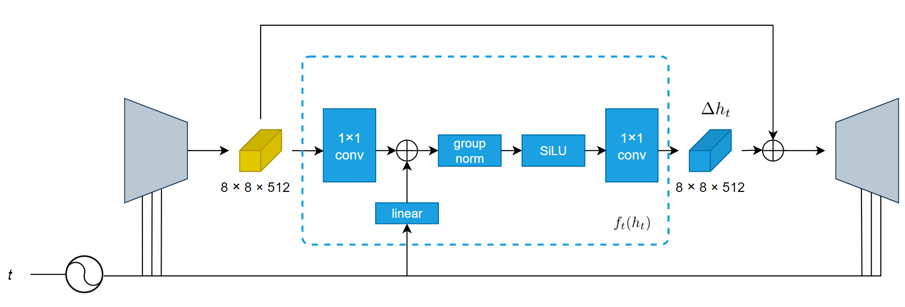</td>
  </tr>
  <tr align="left">
    <td colspan=2><b>Figure 3.</b> Original architecture of the neural network $f_t$ as in the Asyrp paper [8].</td>
  </tr>
</table>

<table align="center">
  <tr align="center">
      <td>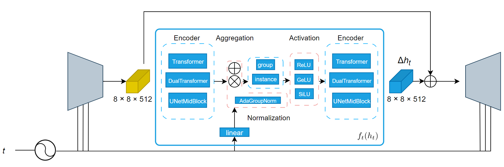</td>
  </tr>
  <tr align="left">
    <td colspan=2><b>Figure 4.</b> Our transformer-based architecture of the neural network $f_t$ and all its variants for the ablation study.</td>
  </tr>
</table>

#### Encoder architecture
The input and output of the module is an embedding of size $w \times h \times c$, which in the case of the CelebA-HQ dataset corresponds to $8 \times 8 \times 512$. We propose to use a transformer based architecture to exchange information between the elements of the embedding more effectively. In order to do so, we interpret the embedding as a sequence of length $n$ of $d$-dimensional tokens. 

We propose two ways of reinterpreting the data to get these sequences. We either interpret the channel dimensions of the image as the token dimension, resulting in a sequence length of $n=64$ with tokens of dimensions $d=512$ (pixel), or we swap these and get a sequence length $n=512$ with tokens of dimensions $d=64$ (channel). For these we use a simple Transformer architecture from the PyTorch framework, with a single transformer layer with a linear layer of dimension 2048. As both of these modules return an output of the same size as the input, we can combine these two interpretations and apply them in serial, leading to pixel-channel and channel-pixel attention. For these we used the Dual Transformer which consists of two simple Transformers, one for the pixel attention and the other for the channel.

<!-- We apply four variants, pixel, channel, pixel-channel & channel-pixel and train them for four epochs. We report the results in table 4. We then pick the architecture with the lowest clip_loss, pixel-channel, and train it with 1,2,4 & heads. -->

#### Temporal embedding module
The temporal information about the denoising step is integrated into the original model by first linearly projecting the timestep embedding and then adding it to the embedding that was processed by the input module. We investigate with the integration of the temporal embedding by changing this addition to a multiplication, additionally we also test integrating the temporal embedding using an adjusted adaptive group norm.

#### Normalization and Activation function
We experiment with 2 ways of normalizing the aggregated output of the encoder: group norm, where the mean and standard deviation are computed at group level (32 groups) and instance norm, where they are computed for each sample individually.
A SiLU activation function is applied to this embedding before it's passed through the final output layer. We examine this activation function by swapping it out for a GeLU and simple ReLU.

## <a name="architecture">Evaluating Diffusion Models</a>

In order to evaluate the performance of diffusion models when it comes to image editing, besides qualitative results and conducting user studies \[8, 7\], the following metrics are generally used: Directional CLIP similarity ($S_{dir}$), segmentation-consistency (SC), Fr\'echet Inception Distance (FID), and face identity similarity (ID). The Asyrp paper uses $S_{dir}$ and SC to compare its performance to DiffusionCLIP, which in turn shows that it outperforms both StyleCLIP \[13\] and StyleGAN-NADA \[4\] in $S_{dir}$ and SC.

The directional CLIP similarity score measures how well the diffusion model preserves the direction of gradients in an image after editing. It is mathematically computed as $1 - \mathcal{L}\_{direction}$, where $\mathcal{L}\_{direction}$ is the directional CLIP loss from Equation 12. The higher the score, the better image editing performance of the model.

Semantic consistency is a metric that has been introduced in order to evaluate the consistency of network predictions on video sequences. In the image editing setting, it compares the segmentation maps of the reference and the edited image by computing the mean intersection over the union of the two. Knowing this, we can reason that high SC scores do not necessarily mean good image content modification, as can be seen in Figure 5. This is an example that clearly shows how this metric fails on evaluating editing performance. The DiffusionCLIP model tries to preserve structure and shape in the image, while Asyrp allows more changes that lead to desired attribute alterations.

<table align="center">
  <tr align="center">
      <td></td>
  </tr>
  <tr align="left">
    <td colspan=2><b>Figure 5.</b> Segmentation masks of the original, Asyrp-edited, and DiffustionCLIP-edited images used to compute segmentation consistency for the "smiling" attribute. \[8\].</td>
  </tr>
</table>

The FID metric compares the distribution of the edited images with the distribution of the referential images in a feature space. Lower FID scores correspond to better image editing. In order to compute the image features, one commonly employs the Inception-v3 model \[18\]. In particular, the model's activations of the last layer prior to the output classification layer are calculated for a set of edited and source images. The mean and the covariance of the activations is computed, so they can be modelled as multivariate Gaussians: $\mathcal{N}(\mu, \Sigma)$ being the distribution of the edited images' features and $\mathcal{N}(\mu_{ref}, \Sigma_{ref})$ the distribution of the reference images' features. The FID is then calculated as follows:

$$FID = \Vert \mu - \mu\_{ref} \Vert_2^2 + tr \left( \Sigma + \Sigma\_{ref} - 2 { \left( \Sigma^\frac{1}{2} \Sigma\_{ref} \Sigma^\frac{1}{2} \right) }^\frac{1}{2} \right). \qquad \qquad \text{(Equation 14)}$$

## <a name="reproduction">Reproduction of the Experiments</a>

We begin by reproducing the qualitative and quantitative results of the original paper. To sustain the limits of our computational budget, we restrict our efforts to the CelebA-HQ \[6\] dataset. Our experiments are based on the [original implementation](https://github.com/kwonminki/Asyrp_official/tree/main/models), however, we found that some of the features required for successful reproduction, especially those relating to quantitative evaluation, are missing from the repository. Generally, we follow the computational set-up specified by the original authors in full. Specifically, we use hyperparameter values presented in Table 1, which were recovered from \[8, Table 2\] and \[8, Table 3\]. Across all experiments, we use $\lambda\_{\text{recon}} = 3 * \frac{\Delta T}{\Vert \Delta T \Vert}$, i.e., the cosine similarity of the source and target prompts, and $t_{\text{boost}} = 167$ as recommended by the original authors. Unless specified otherwise, we use 40 time steps during both the inversion and generation phase of training and inference. We train the models using 1000 training images over a single epoch.

<table align="center">
  <tr align="center">
      <th align="left">Label</th>
      <th align="left">$y_{ref}$</th>
      <th align="left">$y_{target}$</th>
      <th>$\lambda_{\text{CLIP}}$</th>
      <th>$t_{\text{edit}}$</th>
      <th>Domain</th>
  </tr>
  <tr align="center">
    <td align="left">smiling</td>
    <td align="left">"face"</td>
    <td align="left">"smiling face"</td>
    <td>0.8</td>
    <td>513</td>
    <td>IN</td>
  </tr>
  <tr align="center">
    <td align="left">sad</td>
    <td align="left">"face"</td>
    <td align="left">"sad face"</td>
    <td>0.8</td>
    <td>513</td>
    <td>IN</td>
  </tr>
  <tr align="center">
    <td align="left">angry</td>
    <td align="left">"face"</td>
    <td align="left">"angry face"</td>
    <td>0.8</td>
    <td>512</td>
    <td>IN</td>
  </tr>
  <tr align="center">
    <td align="left">tanned</td>
    <td align="left">"face"</td>
    <td align="left">"tanned face"</td>
    <td>0.8</td>
    <td>512</td>
    <td>IN</td>
  </tr>
  <tr align="center">
    <td align="left">man</td>
    <td align="left">"a person"</td>
    <td align="left">"a man"</td>
    <td>0.8</td>
    <td>513</td>
    <td>IN</td>
  </tr>
  <tr align="center">
    <td align="left">woman</td>
    <td align="left">"a person"</td>
    <td align="left">"a woman"</td>
    <td>0.8</td>
    <td>513</td>
    <td>IN</td>
  </tr>
  <tr align="center">
    <td align="left">young</td>
    <td align="left">"person"</td>
    <td align="left">"young person"</td>
    <td>0.8</td>
    <td>515</td>
    <td>IN</td>
  </tr>
  <tr align="center">
    <td align="left">curly hair</td>
    <td align="left">"person"</td>
    <td align="left">"person with curly hair"</td>
    <td>0.8</td>
    <td>499</td>
    <td>IN</td>
  </tr>
  <tr align="center">
    <td align="left">nicolas</td>
    <td align="left">"Person"</td>
    <td align="left">"Nicolas Cage"</td>
    <td>0.8</td>
    <td>461</td>
    <td>UN</td>
  </tr>
  <tr align="center">
    <td align="left">pixar</td>
    <td align="left">"Human"</td>
    <td align="left">"3D render in the style of Pixar"</td>
    <td>0.8</td>
    <td>446</td>
    <td>UN</td>
  </tr>
  <tr align="center">
    <td align="left">neanderthal</td>
    <td align="left">"Human"</td>
    <td align="left">"Neanderthal"</td>
    <td>1.2</td>
    <td>490</td>
    <td>UN</td>
  </tr>
  <tr align="center">
    <td align="left">modigliani</td>
    <td align="left">"photo"</td>
    <td align="left">"Painting in Modigliani style"</td>
    <td>0.8</td>
    <td>403</td>
    <td>UN</td>
  </tr>
  <tr align="center">
    <td align="left">frida</td>
    <td align="left">"photo"</td>
    <td align="left">"self-portrait by Frida Kahlo"</td>
    <td>0.8</td>
    <td>321</td>
    <td>UN</td>
  </tr>
  <tr align="left">
    <td colspan=7><b>Table 1.</b> Hyperparameter settings of reproducibility experiments. The "domain" column corresponds to the attribute being in-domain (IN) or unseen-domain (UN).</td>
  </tr>
</table>

Figure 6 shows that the results obtained in the original paper and presented in \[8, Figure 4\] can be successfully reproduced and that editing in the h-space results in visually convincing image generation for in-domain attributes (i.e., attributes that can be directly observed in the training data of the frozen diffusion model). Nevertheless, we must stress that the methodology does not necessarily isolate attribute changes and particular edits may also result in other unintended changes. To give an example, edits for the "curly hair" attribute result in severe facial transformations and appear to overlap with the "smiling" attribute (see the second and the third row of Figure 6).

<table align="center">
  <tr align="center">
      <td></td>
  </tr>
  <tr align="left">
    <td colspan=2><b>Figure 6.</b> Editing results for in-domain attributes.</td>
  </tr>
</table>

Figures 7 and 8 depict the results of our reproducibility experiments focused on unseen-domain attributes (i.e., attributes that cannot be observed in the training data) originally presented in \[8, Figure 5\]. In Figure 7, we use the full $\Delta h_t$ as done by the authors. In Figure 8, we reduce the editing strength by half. We observe that for unseen-domain attributes, reduction of the editing strength can significantly reduce invasiveness of the method.

<table align="center">
  <tr align="center">
      <td></td>
  </tr>
  <tr align="left">
    <td colspan=2><b>Figure 7.</b> Editing results for unseen-domain attributes.</td>
  </tr>
</table>

<table align="center">
  <tr align="center">
      <td></td>
  </tr>
  <tr align="left">
    <td colspan=2><b>Figure 8.</b> Editing results for unseen-domain attributes with reduced editing strength ($0.5 \Delta h_t$).</td>
  </tr>
</table>

To appreciate the performance of Asyrp quantitatively, we reproduce evaluation results originally presented in \[8, Table 4\] and compute the directional CLIP score for the same three in-domain attributes ("smiling", "sad", "tanned") and two unseen-domain attributes ("pixar", "neanderthal") on a set of 100 images from the test set. The original code does not implement either of the evaluation metrics or experiments, meaning we do not know which images were used for the calculations. We choose to take the first 100 images in terms of image IDs. The results are reported in Table 2. Contrary to the original authors, we supply standard deviations showing that the results are quite unstable. More importantly, there are clear differences in the achieved results that we cannot easily explain. Nevertheless, we observe a stable trend of higher scores when lowering the editing strength to half as expected because of the decreased impact on $\Delta I$.

<table align="center">
	<tr align="center">
		<th align="left">Metric</th>
		<th></th>
		<th>Smiling (IN)</th>
		<th>Sad (IN)</th>
		<th>Tanned (IN)</th>
		<th>Pixar (UN)</th>
		<th>Neanderthal (UN)</th>
	</tr>
	<tr align="center">
		<td align="left">Original $S_{dir}$</td>
		<td>$\Delta h_t$</td>
		<td>0.921</td>
		<td>0.964</td>
		<td>0.991</td>
		<td>0.956</td>
		<td>0.805</td>
	</tr>
	<tr align="center">
		<td align="left">Reproduced $S_{dir}$</td>
		<td>$\Delta h_t$</td>
		<td>0.955 (0.048)</td>
		<td>0.993 (0.037)</td>
		<td>0.933 (0.040)</td>
		<td>0.931 (0.032)</td>
		<td>0.913 (0.035)</td>
	</tr>
	<tr align="center">
		<td align="left">Reproduced $S_{dir}$</td>
		<td>$0.5 \Delta h_t$</td>
		<td>0.969 (0.047)</td>
		<td>0.999 (0.035)</td>
		<td>0.973 (0.036)</td>
		<td>0.942 (0.031)</td>
		<td>0.952 (0.035)</td>
	</tr>
	<tr align="left">
		<td colspan=7><b>Table 2.</b> Directional CLIP score ($S_{dir} \ \uparrow$) for in-domain (IN) and unseen-domain (UN) attributes. Standard deviations are reported in parentheses.</td>
	</tr>
</table>

We do not implement the segmentation consistency score due to its shortcomings described in the previous section and also the absence of information on choices made by the original authors with respect to its calculation. To make up for it, we compute FID scores which should represent a more meaningful choice in the context of image editing. From the FID scores presented in Table 3, one can observe worsening performance when Asyrp performs editing in directions requiring more substantial changes of the original image. As expected, lowering the editing strength also significantly and consistently reduces the impact in terms of FID. Naturally, the distance between the reconstructed and the edited images is consistently lower than the distance between original and edited images.

<table align="center">
	<tr align="center">
		<th align="left">Metric</th>
		<th></th>
		<th>Smiling (IN)</th>
		<th>Sad (IN)</th>
		<th>Tanned (IN)</th>
		<th>Pixar (UN)</th>
		<th>Neanderthal (UN)</th>
	</tr>
	<tr align="center">
		<td align="left" rowspan=2>$FID(\mathbf{x}_{orig}, \mathbf{x}_{edit})$</td>
		<td>$\Delta h_t$</td>
		<td>89.2</td>
		<td>92.9</td>
		<td>100.5</td>
		<td>125.8</td>
		<td>125.8</td>
	</tr>
	<tr align="center">
		<td>$0.5 \Delta h_t$</td>
		<td>73.7</td>
		<td>70.6</td>
		<td>73.7</td>
		<td>89.3</td>
		<td>74.8</td>
	</tr>
	<tr align="center">
		<td align="left" rowspan=2>$FID(\mathbf{x}_{recon}, \mathbf{x}_{edit})$</td>
		<td>$\Delta h_t$</td>
		<td>68.8</td>
		<td>60.5</td>
		<td>81.7</td>
		<td>96.9</td>
		<td>137.3</td>
	</tr>
	<tr align="center">
		<td>$0.5 \Delta h_t$</td>
		<td>44.4</td>
		<td>43.7</td>
		<td>49.7</td>
		<td>61.0</td>
		<td>71.7</td>
	</tr>
	<tr align="left">
		<td colspan=7><b>Table 3.</b> Frechet Inception Distance ($FID \ \downarrow$) for in-domain (IN) and unseen-domain (UN) attributes.</td>
	</tr>
</table>

In Figure 9, we present our reproduction of \[8, Figure 7\] visualizing the linearity of the learned editing directions. For the "smiling" attribute, it is clearly viable to go in the opposite direction of $\Delta h_t$ and still produce semantically meaningful results. Moreover, the editing effect is shown to be continuous in editing strength.

<table align="center">
  <tr align="center">
      <td>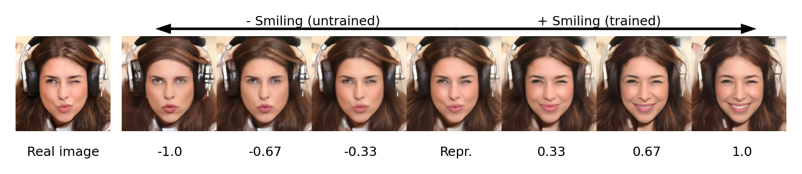</td>
  </tr>
  <tr align="left">
    <td colspan=2><b>Figure 9.</b> Image edits for the "smiling" attribute with editing strength in the range from -1 to 1.</td>
  </tr>
</table>

Figure 10 reproduces the results originally presented in \[8, Figure 17\]. When reconstructing images using a diffusion model with a relatively small number of time steps used for generation, we observe a severe loss in texture resulting in smoothed-out faces with limited details. For training, we used 40 time steps during generation. At inference time, we tried to increase this number to 1,000 and found that it is possible to generate additional texture improving the results at the cost of computation time.

<table align="center">
  <tr align="center">
      <td>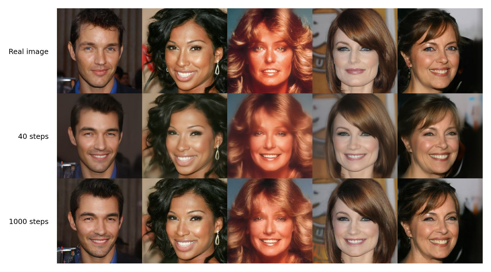</td>
  </tr>
  <tr align="left">
    <td colspan=2><b>Figure 10.</b> Comparison of generated images for the "smiling" attribute with 40 and 1000 time steps during generation.</td>
  </tr>
</table>

## <a name="bias">Bias of the Asyrp model</a>
The editing directions found through the asyrp algorithm depend on the knowledge of attributes contained in CLIP. We observe in the output results that these editing directions are often highly biased. Individuals frequently change gender, skin color and eye color when edited with a direction that does not explicitely contain that change. For example, the Pixar editing direction changes the eyecolor of the source images to blue and often changes dark skin to white skin. This effect likely results from the model not being able to disentangle these concepts and has an impact on how useful these directions are in various image editing contexts. We have included some examples of these biased editing directions in Figure **707**.

<table align="center">
	<tr align="center">
		<th align="left">Metric</th>
		<th>Race</th>
		<th>Smiling (IN)</th>
		<th>Sad (IN)</th>
		<th>Tanned (IN)</th>
		<th>Pixar (UN)</th>
		<th>Neanderthal (UN)</th>
	</tr>
	<tr align="center">
		<td align="left" rowspan=2>$FID(\mathbf{x}_{orig}, \mathbf{x}_{edit})$</td>
		<td>Caucasian</td>
		<td>81.3</td>
		<td>76.2</td>
		<td>75.9</td>
		<td>103.5</td>
		<td>94.1</td>
	</tr>
	<tr align="center">
		<td>Non-caucasian</td>
		<td>138.4</td>
		<td>123.3</td>
		<td>157.3</td>
		<td>185.2</td>
		<td>177.6</td>
	</tr>
	<tr align="center">
		<td align="left" rowspan=2>$FID(\mathbf{x}_{recon}, \mathbf{x}_{edit})$</td>
		<td>Caucasian</td>
		<td>54.3</td>
		<td>55.1</td>
		<td>66.4</td>
		<td>76.6</td>
		<td>111.0</td>
	</tr>
	<tr align="center">
		<td>Non-caucasian</td>
		<td>88.3</td>
		<td>84.1</td>
		<td>121.1</td>
		<td>142.0</td>
		<td>186.8</td>
	</tr>
	<tr align="left">
		<td colspan=7><b>Table 4.</b> Frechet Inception Distance ($FID \ \downarrow$) for in-domain (IN) and unseen-domain (UN) attributes compared between   caucasian and non-caucasian individuals.</td>
	</tr>
</table>

<table align="center">
  <tr align="center">
      <td>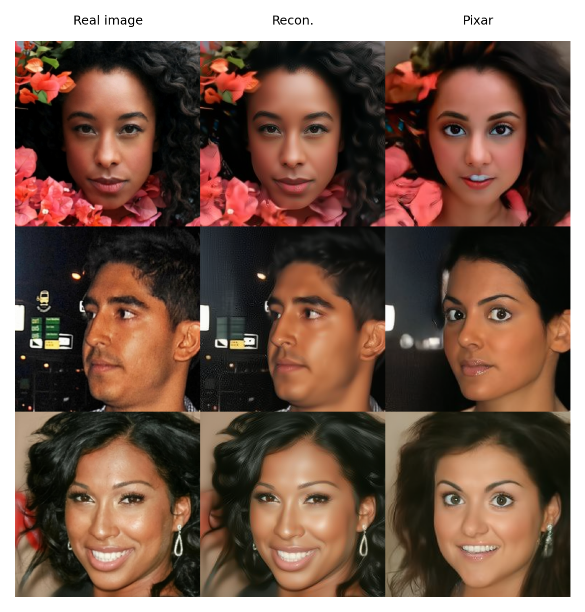</td>
  </tr>
  <tr align="left">
    <td colspan=2><b>Figure 707.</b> Bias in the CLIP editing directions for the "pixar" attribute.</td>
  </tr>
</table>

## <a name="ablation">Ablation study</a>
While the reproduction results show that the general method works well, we set out to investigate further improvements by running an ablation study. As previously mentioned in the [fourth](#architecture) section adjustments to the model architecture could provide further gains in performance in terms of the clip similairty, flexibility and transferability. In this section, we conduct several ablations in order to gain a deeper understanding of the asyrp method, aiming to identify its limitations and explore potential improvements.

### Model architecture
As described in the [model architecture](#architecture) section and shown in Figure 4 the Asyrp method can be broken down into multiple submodules: the two encoder modules, a temporal embedding module and an activation function module. In this section we will look more closely at these modules and propose several adjustments, which we compare to the original implementation. The best modules are picked based on the lowest CLIP directional loss, which is inversely related to the Directional CLIP Similarity as explained in the [evaluation](#evalution) section. 

#### Encoder architecture
As discussed in the architecture section the 1x1 convolutional layers can be replaced by transformer-based blocks. However, "transformer" is a broad term and here we show the ablations we did to get to the final architecture. Firstly, it is important to consider the numbers of epochs. The original architecture was only trained for one epoch, however this might not be suitable for transformer-based blocks as they typically take longer to train. We present all our results for one to four epochs since this hyperparameter holds significant importance in our study.

Next an important architectural decision for the transformer blocks was the number of heads to use. In Figure **222** we investigate the optimal number of heads. As can be seen more heads leads to better performance, however it comes at an computational cost. Therefor we decided to stick to 1 head for the remainder of the ablations, unless said otherwise. Figure **166** visually shows the results for different number of heads for the "pixar" attribute.

<table align="center">
  <tr align="center">
      <td></td>
  </tr>
  <tr align="left">
    <td colspan=2><b>Figure 222.</b> The effect of the number of transformer heads on the directional CLIP loss curve during training.</td>
  </tr>
</table>

<table align="center">
  <tr align="center">
      <th>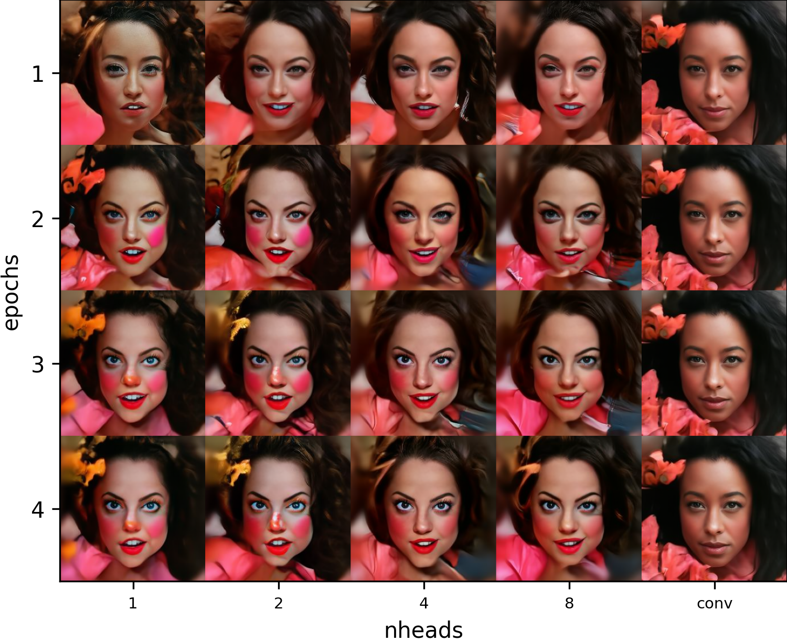</th>
      <th>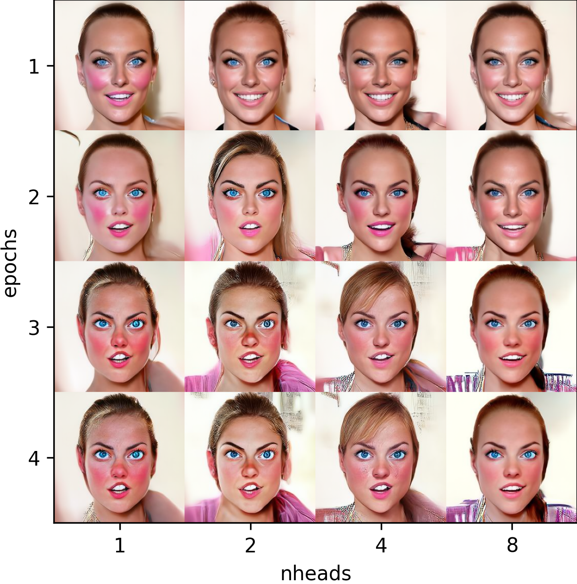</th>
      <th></th>
  </tr>
  <tr align="left">
    <td colspan=3><b>Figure 166.</b> The effect of the number of transformer heads on the "pixar" attribute for the pixel-channel transformer architecture.</td>
  </tr>
</table>

Lastly, as mentioned in the architecture section there are four ways to interpret the bottleneck feature map to get the input sequences for the transformer blocks. In Figure **182** we compare the different variants for the "neanderthal" attribute. For the remainder of the ablations we picked the pixel-channel dual transformer block, because it achieves the lowest CLIP directional loss as shown Figure **123**.

<table align="center">
  <tr align="center">
      <th>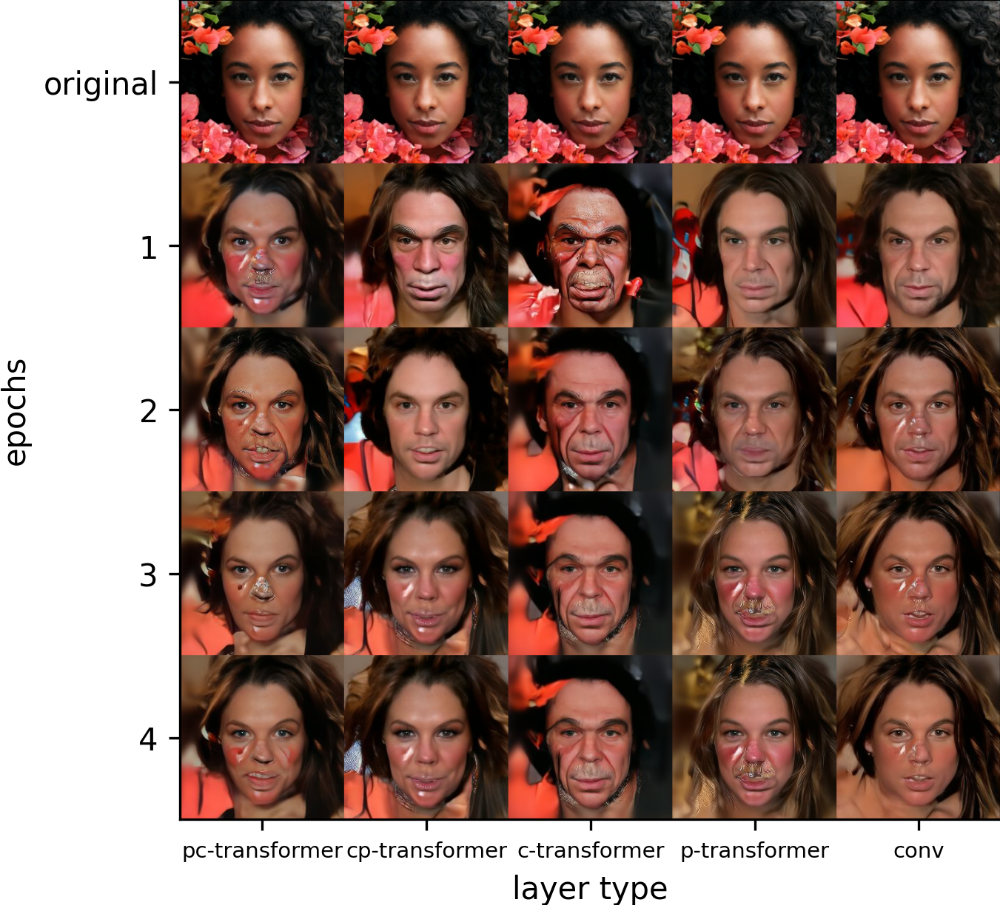</th>
      <th>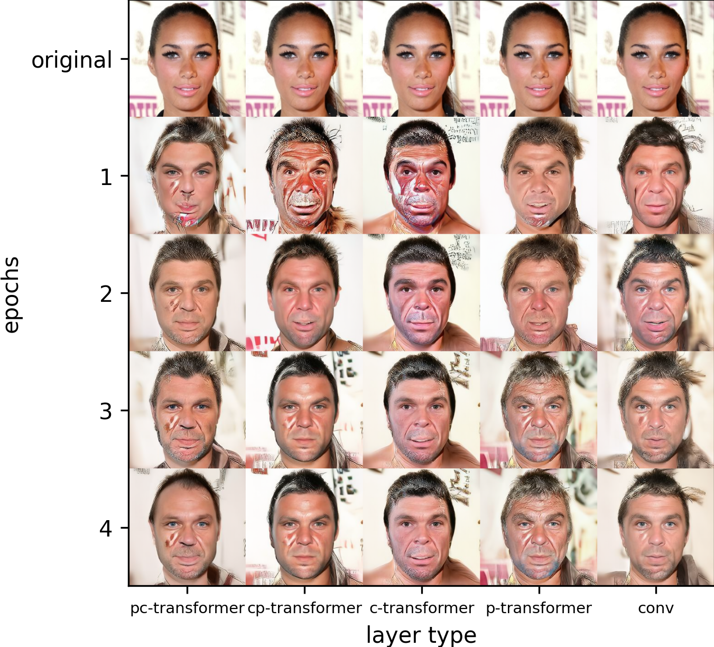</th>
      <th>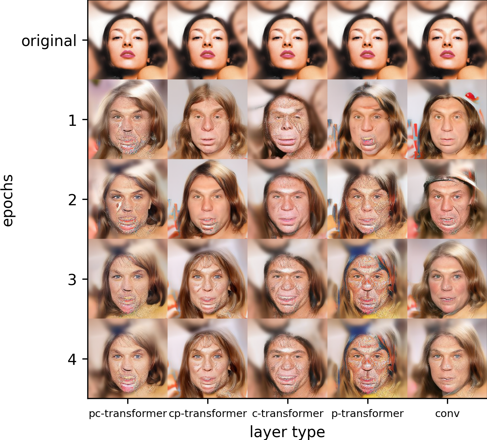</th>
  </tr>
  <tr align="left">
    <td colspan=3><b>Figure 182.</b> The effect of the input sequence type for the "neanderthal" attribute across pixel-channel (pc), channel-pixel (cp), pixel (p), channel (c), and convolution-based (conv) architectures.</td>
  </tr>
</table>

<table align="center">
  <tr align="center">
      <td>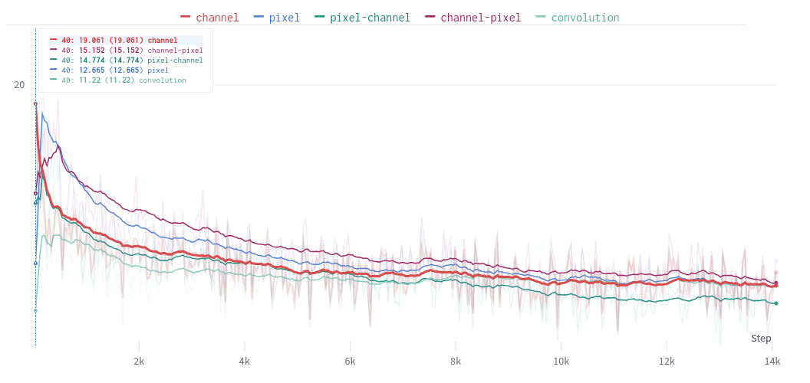</td>
  </tr>
  <tr align="left">
    <td colspan=2><b>Figure 123.</b> The effect of input sequence type on the directional CLIP loss curve during training.</td>
  </tr>
</table>

<table align="center">
	<tr align="center">
		<th align="left">Metric</th>
		<th>Epoch 1</th>
		<th>Epoch 2</th>
		<th>Epoch 3</th>
		<th>Epoch 4</th>
	</tr>
	<tr align="center">
		<td align="left">$FID(\mathbf{x}_{orig}, \mathbf{x}_{edit})$</td>
		<td>113.2</td>
		<td>94.2</td>
		<td>104.9</td>
		<td>100.8</td>
	</tr>
	<tr align="center">
		<td align="left">$FID(\mathbf{x}_{recon}, \mathbf{x}_{edit})$</td>
		<td>105.5</td>
		<td>93.2</td>
		<td>101.4</td>
		<td>98.3</td>
	</tr>
	<tr align="left">
		<td colspan=5><b>Table 5.</b> Frechet Inception Distance ($FID \ \downarrow$) with pixel-channel   architecture for the "pixar "attribute across epochs.</td>
	</tr>
</table>

#### Temporal embedding module
The temporal information about the denoising step is integrated into the original model by first linearly projecting the timestep embedding and then adding it to the embedding that was processed by the input module. In this section we investigate the integration of the temporal embedding by changing this addition to a multiplication, additionally we also test integrating the temporal embedding using an adjusted adaptive group norm.

#### Activation function
A swish activation function is applied to the embedding before it's passed through the final output layer. We examine this layers this activation function by swapping it out for a GLU and simple ReLU --> what did we come up with

### Hyperparameter dependency
As detailed in the reproduction section, retraining for a single attribute already requires a significant amount of time even with the hyperparameters known. If the method was to be used in practise it is not realistic to hyperparameter tune from scratch for every new attribute. Therefor we looked into how the model performs while using a standard set of parameters instead. Note that the original paper uses stochastic gradient descent and a very high learning rate to train, which notoriously requires comparatively more tuning than an Adam optimizer. 

This is convenient as the transformer modules are trained with an Adam optimizer anyway. While we tried to use Adam to optimize the original architecture, this resulted in very poor results. In order to demonstrate the significance of hyperparameters, we utilized both the original architecture optimized with SGD and the transformer-based architecture to train the method for a new attribute, employing non-tuned standard parameters. Figure **289** shows the results for the attribute "goblin", highlighting that the output non-tuned transformer-based approach gives a relatively better performance.

<table align="center">
  <tr align="center">
      <th></th>
      <th></th>
  </tr>
  <tr align="left">
    <td colspan=2><b>Figure 201.</b> Comparison of convolution-based and transformer-based architecture output   for a new "goblin" attribute without hyperparameter tuning.</td>
  </tr>
</table>

During inference an interesting hyperparameter is the editing strength and its relation to the number of heads. It appears that as the number of heads increases, the magnitude of editing strength needed decreases. In other words, we can see a trend where better models can edit more subtly. While this might be computationally unfeasible to use this in practise right now, this does hint that there exist good editing directions in the bottleneck. The results for different editing strengths is shown in Figure **201**.

<table align="center">
  <tr align="center">
      <th>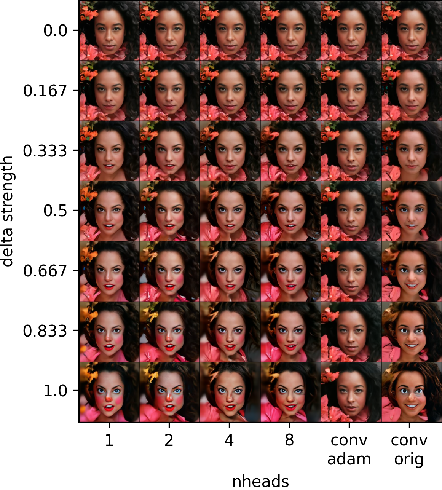</th>
      <th>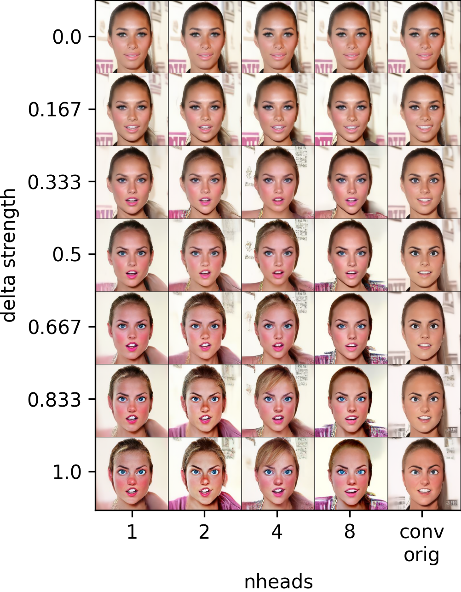</th>
      <th>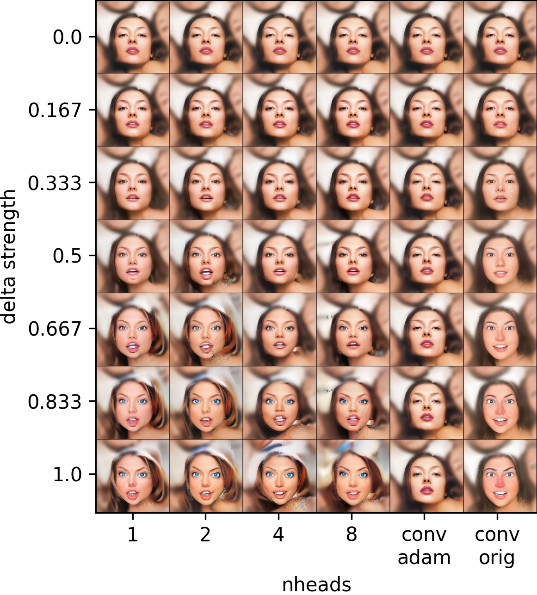</th>
  </tr>
  <tr align="left">
    <td colspan=3><b>Figure 201.</b> The effect of the editing strength when using pixel-channel transformer with various numbers of heads on the "pixar" attribute.</td>
  </tr>
</table>

### Transfer-Learning between attributes
During training we often observed that the model first has to learn how to reconstruct the original image, effectively ignoring the added asyrp architecture, before it learns to edit the image through the clip directional loss. 
We therefore hypothesize that using pretrained weights from a different attribute than the target attribute should speed up training. We perform transfer learning from the 

## Further Research: Latent Diffusion Models
Lastly in this blog post we set out to investigate whether Asyrp can also be applied on top of a latent diffusion model. Since LDMs currently represent the state-of-the-art in image generation \[16\], it is reasonable to find out if modifications in the h-space lead to meaningful attribute edits in the original images. Conveniently DDIM, the algorithm on which Asyrp was build, is also the algorithm behind LDMs. However, the diffusion process runs in the latent space instead of the pixel space. A sperate VQ-VAE  is trained \[19\], where the encoder $\mathcal{E}$ is used to compress the image $x_0$ to a smaller latent vector $z_0$ and the decoder $\mathcal{D}$ is used to reconstruct the image $\hat{x}_0$ from the computed latent vector $\hat{z}_0$. All the remaining steps are as described in the [second](#recap) and [third](#discover) section, but replacing $x$ by $z$. This leads to training a neural network $\epsilon\_\theta \left( z_t, t \right)$ and optimizing it with the loss in Equation 15. Furthermore, steps in the reverse process can be sampled with Equation 16.

$$L_{L D M} := \mathbb{E}\_{ \mathcal{E}(x), \epsilon \sim \mathcal{N}(0, 1), t } \left\[ \left\| \epsilon - \epsilon\_\theta \left( z_t, t \right) \right\|_2^2 \right\] \qquad \qquad \text{(Equation 15)}$$

$$z_{t-1} = \sqrt{\alpha\_{t-1}} \mathbf{P}\_t \left( \epsilon\_\theta \left( z_t, t \mid \Delta h_t \right) \right) + \mathbf{D}\_t \left( \epsilon\_\theta \left( z_t, t \right) \right) + \sigma_t v_t \qquad \qquad \text{(Equation 16)}$$

However, to calculate the directional CLIP loss both the reference and the generated image are needed, but the whole point of LDMs is that you do not calculate those every step. One aproach to still use the Asyrp algorithm could be to retrain CLIP for LDM latents instead of images, but this is beyond our scope. Therefor we investigated another aproach in which the images are computed from the latents by running the decoder $\mathcal{D}$ on $z_t$ at every time-step. Initially we questioned whether this approach would be fruitful as the VQ-VAE is only trained to reconstruct real images and not images perturbed by different levels of noise. In Figure 872 the results can be seen of running $\mathcal{D}$ on $z_t$ of a LDM at every time step. While this is no conclusive result, it does seem to hint that this approach would be feasible. 

<table align="center">
  <tr align="center">
      <td></td>
  </tr>
  <tr align="left">
    <td colspan=2><b>Figure 872.</b> Running the VQ-VAE decoder on the latent at every time step.</td>
  </tr>
</table>

That being said this section is called future research for a reason. Sadly the original code-base was not very modular and this made applying Asyrp to another DM or LDM not feasible within the scope of this project. Asyrp was build directly into a random DM code-base and thus applying it to a LDM would mean starting from scratch in a LDM code-base. Furthermore running the decoder on the latent and accessing the bottleneck feature map at every step meant that we had to edit low level code of large code-bases. Therefor eventually we decided to keep this as future research.

## Concluding Remarks
The Asyrp model presented in the original paper and thoroughly explained in the [Discovering Semantic Latent Space](#discover) and [Model Architecture](#architecture) sections, successfully discovers a semantic latent space in the bottleneck of frozen diffusion models which allows high quality image editing. This is supported by our reproduction study, which was conducted on the CelebA-HQ dataset, using the pretrained DDPM model. The figures in the [Reproduction of the Experiments](#reproduction) section highlight the editing abilities of the model for both in- (eg. smiling, sad, angry) and unseen-domain (eg. Pixar, Neanderthal, Frida) attributes. For the quantitative evaluation, we used the directional CLIP score, as this was reported in the original paper and the FID score. Both of the two metrics have shown better results for in-domain editing in the case of the reproduction study, and agree with the original findings that Neanderthal is the hardest editing direction. The best results are for "sad" and "smiling". The discovered semantic latent space has the properties of linearity and consistency across timesteps which are validated by our reproduction experiments.

We explored the limitations of the orginal model and discovered two main problems: first, that it is heavily biased and section [Bias of the Asyrp model](#bias) shows that the model performs much better on editing images of caucasian people than non-caucasian and also that individuals frequently change gender and eye color and second, that the model needs retraining and has a different hyperparamenter configuration for each attribute. 

We further investigated the capabilities of Asyrp by changing its architecture from convolutional layers to a transformer encoder, as it was presented in the [Model Architecture](#architecture) section. We then conducted an ablation study on this new architecture and shown the impact of distinct ways of attending to the bottleneck feature map, different ways of aggregating the temporal encodings, various normalization methods and activation functions. We concluded that our best model
outperforms the original Asyrp by evaluating both qualitatively and quantitatively, as it was shown in the [Ablation study](#ablation) section. We got a better FID score than the orignal model and also, by looking at the figures we clearly observed that our model captures and edits more fine grained features, thus having a stronger impact on the quality of the edited image.

LDM conclusion as in next research direction. 

## Authors' Contributions

## Bibliography

[1] Jooyoung Choi, Sungwon Kim, Yonghyun Jeong, Youngjune Gwon, and Sungroh Yoon. [ILVR: Conditioning Method for Denoising Diffusion Probabilistic Models](https://arxiv.org/abs/2108.02938). In: CVF International Conference on Computer Vision (ICCV). 2021, pp. 14347–14356.

[2] Jiankang Deng, Jia Guo, Niannan Xue, and Stefanos Zafeiriou. “Arcface: Additive angular margin loss for deep face recognition”. In: Proceedings of the IEEE/CVF conference on computer vision and pattern recognition. 2019, pp. 4690–4699.

[3] Prafulla Dhariwal and Alexander Nichol. “Diffusion models beat gans on image synthesis”. In: Advances in Neural Information Processing Systems 34 (2021), pp. 8780–8794.

[4] Rinon Gal, Or Patashnik, Haggai Maron, Amit H Bermano, Gal Chechik, and Daniel Cohen-Or. “StyleGAN-NADA: CLIP-guided domain adaptation of image generators”. In: ACM Transactions on Graphics (TOG) 41.4 (2022), pp. 1–13.[18]

[5] Jonathan Ho, Ajay Jain, and Pieter Abbeel. “Denoising diffusion probabilistic models”. In: Advances in Neural Information Processing Systems 33 (2020), pp. 6840–6851.

[6] Tero Karras, Timo Aila, Samuli Laine, and Jaakko Lehtinen. “Progressive growing of gans for improved quality, stability, and variation”. In: arXiv preprint arXiv:1710.10196 (2017).

[7] Gwanghyun Kim and Jong Chul Ye. “Diffusionclip: Text-guided image manipulation using diffusion models”. In: (2021).

[8] Mingi Kwon, Jaeseok Jeong, and Youngjung Uh. “Diffusion models already have a semantic latent space”. In: arXiv preprint arXiv:2210.10960 (2022).

[9] Xihui Liu, Dong Huk Park, Samaneh Azadi, Gong Zhang, Arman Chopikyan, Yuxiao Hu, Humphrey Shi, Anna Rohrbach, and Trevor Darrell. “More control for free! image synthesis with semantic diffusion guidance”. In: Proceedings of the IEEE/CVF Winter Conference on Applications of Computer Vision. 2023, pp. 289–299.

[10] Chenlin Meng, Yang Song, Jiaming Song, Jiajun Wu, Jun-Yan Zhu, and Stefano Ermon. “Sdedit: Image synthesis and editing with stochastic differential equations”. In: arXiv preprint arXiv:2108.01073 (2021).

[11] Alexander Quinn Nichol and Prafulla Dhariwal. “Improved denoising diffusion probabilistic models”. In: International Conference on Machine Learning. PMLR. 2021, pp. 8162–8171.

[12] Yong-Hyun Park, Mingi Kwon, Junghyo Jo, and Youngjung Uh. “Unsupervised Discovery of Semantic Latent Directions in Diffusion Models”. In: arXiv preprint arXiv:2302.12469 (2023).

[13] Or Patashnik, Zongze Wu, Eli Shechtman, Daniel Cohen-Or, and Dani Lischinski. “Styleclip: Text-driven manipulation of stylegan imagery”. In: Proceedings of the IEEE/CVF International Conference on Computer Vision. 2021, pp. 2085–2094.

[14] Konpat Preechakul, Nattanat Chatthee, Suttisak Wizadwongsa, and Supasorn Suwajanakorn. “Diffusion autoencoders: Toward a meaningful and decodable representation”. In: Proceedings of the IEEE/CVF Conference on Computer Vision and Pattern Recognition. 2022, pp. 10619-10629.

[15] Alec Radford, Jong Wook Kim, Chris Hallacy, Aditya Ramesh, Gabriel Goh, Sandhini Agarwal, Girish Sastry, Amanda Askell, Pamela Mishkin, Jack Clark, et al. “Learning transferable visual models from natural language supervision”. In: International conference on machine learning. PMLR. 2021, pp. 8748–8763.

[16] Robin Rombach, Andreas Blattmann, Dominik Lorenz, Patrick Esser, and Bj ̈orn Ommer. High-Resolution Image Synthesis with Latent Diffusion Models. 2021. arXiv: 2112.10752 [cs.CV].

[17] Jiaming Song, Chenlin Meng, and Stefano Ermon. “Denoising diffusion implicit models”. In: arXiv preprint arXiv:2010.02502 (2020).

[18] C. Szegedy, V. Vanhoucke, S. Ioffe, J. Shlens and Z. Wojna. [Rethinking the Inception Architecture for Computer Vision](https://ieeexplore.ieee.org/document/7780677). 2016 IEEE Conference on Computer Vision and Pattern Recognition (CVPR), Las Vegas, NV, USA, 2016, pp. 2818-2826, doi: 10.1109/CVPR.2016.308.

[19] Aaron van den Oord, Oriol Vinyals, Koray Kavukcuoglu. "Neural Discrete Representation Learning". Advances in neural information processing systems 30 (2017). 
